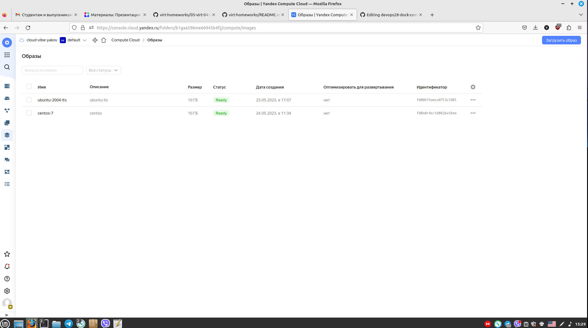
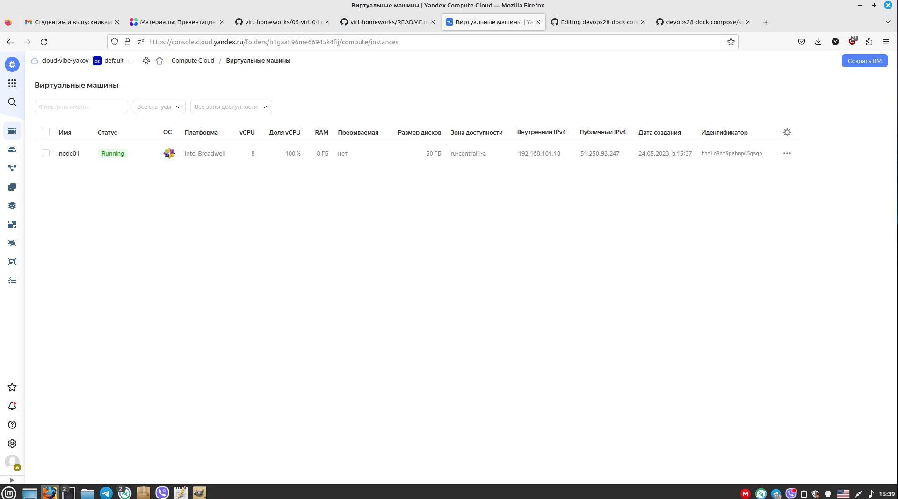

# Домашнее задание к занятию "4. Оркестрация группой Docker контейнеров на примере Docker Compose"

## Как сдавать задания

Обязательными к выполнению являются задачи без указания звездочки. Их выполнение необходимо для получения зачета и диплома о профессиональной переподготовке.

Задачи со звездочкой (*) являются дополнительными задачами и/или задачами повышенной сложности. Они не являются обязательными к выполнению, но помогут вам глубже понять тему.

Домашнее задание выполните в файле readme.md в github репозитории. В личном кабинете отправьте на проверку ссылку на .md-файл в вашем репозитории.

Любые вопросы по решению задач задавайте в чате учебной группы.

---


## Важно!

Перед отправкой работы на проверку удаляйте неиспользуемые ресурсы.
Это важно для того, чтоб предупредить неконтролируемый расход средств, полученных в результате использования промокода.

Подробные рекомендации [здесь](https://github.com/netology-code/virt-homeworks/blob/virt-11/r/README.md)

---

## Задача 1

Создать собственный образ  любой операционной системы (например, ubuntu-20.04) с помощью Packer ([инструкция](https://cloud.yandex.ru/docs/tutorials/infrastructure-management/packer-quickstart))

Для получения зачета вам необходимо предоставить скриншот страницы с созданным образом из личного кабинета YandexCloud.
<p align="center">
  
</p>

## Задача 2

Создать вашу первую виртуальную машину в YandexCloud с помощью terraform. 
Используйте terraform код в директории ([src/terraform](https://github.com/netology-group/virt-homeworks/tree/virt-11/05-virt-04-docker-compose/src/terraform))
```
yaha@yahawork:~/obraz2/terr$ terraform apply

Terraform used the selected providers to generate the following execution plan. Resource actions are indicated with the following symbols:
  + create

Terraform will perform the following actions:

  # yandex_compute_instance.node01 will be created
  + resource "yandex_compute_instance" "node01" {
      + allow_stopping_for_update = true
      + created_at                = (known after apply)
      + folder_id                 = (known after apply)
      + fqdn                      = (known after apply)
      + gpu_cluster_id            = (known after apply)
      + hostname                  = "node01.netology.cloud"
      + id                        = (known after apply)
      + metadata                  = {
          + "ssh-keys" = <<-EOT
                centos:ssh-rsa AAAAB3NzaC1yc2EAAAADAQABAAACAQCgaTUKHS9TAvkidX0sHG3Z8WE95Hm4hSKzGuGJGbAs+/U/FYCc9G7WPb6d+G6/pkG9BbSNk9sXhPdaDNNz+DnBJEypapCx5vvM+oiXcJotOaEthf+B5goY++p5Wr5rGn5bZNy8ZR7FkvCLxu+QDjWNtqMmlu7kJvENBx/I2SfIevxGv/gGFTwrKC0OBJP6kdZvCO3xGyZi1gJPImsP+W2S32qJlb3H4iKLO06+vQGSH3Q19QmraPCszghtzGmC03HozPKeJViibdg+/T+snK8Bx7QrpEMOOrs520LfFoXcWHU7pN/md8Nse6CL6HO6J0NT+5UVtzSWt9py/txoGUtno9C89lDIkvhZkeRxXbyiQ54LUKjmZMCRvrvafMex9DpgQocnF/Iof5iWitYGdQpuWAptrKHSiXwAJ0ij1nrHP4fg/Ot5SvjWZhHghI2IAFABwAjISAu611541nC29/i/6uuna/zKraD3mhtlPxrbPObliVYvPLG0ACTF2xUeUHzgleAZKp/FlDUTdUBxWh6s14sWNYCA0VhNxwmw3w7VPGQkJ/JiCRzRtGCt9cGk6yIBVJX9lhD8VOONoqCrsQpbnl1XqaOh/9mMo+JX7elEy8I1BiKxNQ5REPcPeDnLnsIX9VOAaIAW/o52NMm1V/K2jqECXtH0KTgdoiUxxETtSQ== yahanext@gmail.com
            EOT
        }
      + name                      = "node01"
      + network_acceleration_type = "standard"
      + platform_id               = "standard-v1"
      + service_account_id        = (known after apply)
      + status                    = (known after apply)
      + zone                      = "ru-central1-a"

      + boot_disk {
          + auto_delete = true
          + device_name = (known after apply)
          + disk_id     = (known after apply)
          + mode        = (known after apply)

          + initialize_params {
              + block_size  = (known after apply)
              + description = (known after apply)
              + image_id    = "fd8n0r4sr1d88j6v1kmo"
              + name        = "root-node01"
              + size        = 50
              + snapshot_id = (known after apply)
              + type        = "network-nvme"
            }
        }

      + network_interface {
          + index              = (known after apply)
          + ip_address         = (known after apply)
          + ipv4               = true
          + ipv6               = (known after apply)
          + ipv6_address       = (known after apply)
          + mac_address        = (known after apply)
          + nat                = true
          + nat_ip_address     = (known after apply)
          + nat_ip_version     = (known after apply)
          + security_group_ids = (known after apply)
          + subnet_id          = (known after apply)
        }

      + resources {
          + core_fraction = 100
          + cores         = 8
          + memory        = 8
        }
    }

  # yandex_vpc_network.default will be created
  + resource "yandex_vpc_network" "default" {
      + created_at                = (known after apply)
      + default_security_group_id = (known after apply)
      + folder_id                 = (known after apply)
      + id                        = (known after apply)
      + labels                    = (known after apply)
      + name                      = "net"
      + subnet_ids                = (known after apply)
    }

  # yandex_vpc_subnet.default will be created
  + resource "yandex_vpc_subnet" "default" {
      + created_at     = (known after apply)
      + folder_id      = (known after apply)
      + id             = (known after apply)
      + labels         = (known after apply)
      + name           = "subnet"
      + network_id     = (known after apply)
      + v4_cidr_blocks = [
          + "192.168.101.0/24",
        ]
      + v6_cidr_blocks = (known after apply)
      + zone           = "ru-central1-a"
    }

Plan: 3 to add, 0 to change, 0 to destroy.

Changes to Outputs:
  + external_ip_address_node01_yandex_cloud = (known after apply)
  + internal_ip_address_node01_yandex_cloud = (known after apply)

Do you want to perform these actions?
  Terraform will perform the actions described above.
  Only 'yes' will be accepted to approve.

  Enter a value: yes

yandex_vpc_network.default: Creating...
yandex_vpc_network.default: Creation complete after 1s [id=enp2iutih97joh7t1gp5]
yandex_vpc_subnet.default: Creating...
yandex_vpc_subnet.default: Creation complete after 0s [id=e9b2skfonnd0r3b9h180]
yandex_compute_instance.node01: Creating...
yandex_compute_instance.node01: Still creating... [10s elapsed]
yandex_compute_instance.node01: Still creating... [20s elapsed]
yandex_compute_instance.node01: Still creating... [30s elapsed]
yandex_compute_instance.node01: Creation complete after 38s [id=fhmlo8qt9pahmp65qsqn]

Apply complete! Resources: 3 added, 0 changed, 0 destroyed.

Outputs:

external_ip_address_node01_yandex_cloud = "51.250.93.247"
internal_ip_address_node01_yandex_cloud = "192.168.101.18"
yaha@yahawork:~/obraz2/terr$ 

```
<p align="center">
  
</p>

Для получения зачета, вам необходимо предоставить вывод команды terraform apply и страницы свойств созданной ВМ из личного кабинета YandexCloud.

## Задача 3

С помощью ansible+docker-compose разверните на виртуальной машине из предыдущего задания систему мониторинга на основе Prometheus/Grafana .
Используйте ansible код в директории ([src/ansible](https://github.com/netology-group/virt-homeworks/tree/virt-11/05-virt-04-docker-compose/src/ansible))

Для получения зачета вам необходимо предоставить вывод команды "docker ps" , все контейнеры, описанные в ([docker-compose](https://github.com/netology-group/virt-homeworks/blob/virt-11/05-virt-04-docker-compose/src/ansible/stack/docker-compose.yaml)),  должны быть в статусе "Up".
```
[root@node01 centos]# docker ps
CONTAINER ID   IMAGE                              COMMAND                  CREATED              STATUS                    PORTS                                                                              NAMES
eca0e16db40e   prom/node-exporter:v0.18.1         "/bin/node_exporter …"   About a minute ago   Up 47 seconds             9100/tcp                                                                           nodeexporter
6cf1412f862d   stefanprodan/caddy                 "/sbin/tini -- caddy…"   About a minute ago   Up 46 seconds             0.0.0.0:3000->3000/tcp, 0.0.0.0:9090-9091->9090-9091/tcp, 0.0.0.0:9093->9093/tcp   caddy
52de4804224d   prom/prometheus:v2.17.1            "/bin/prometheus --c…"   About a minute ago   Up 47 seconds             9090/tcp                                                                           prometheus
cfa018db5e6e   gcr.io/cadvisor/cadvisor:v0.47.0   "/usr/bin/cadvisor -…"   About a minute ago   Up 47 seconds (healthy)   8080/tcp                                                                           cadvisor
09ea2a607500   prom/pushgateway:v1.2.0            "/bin/pushgateway"       About a minute ago   Up 47 seconds             9091/tcp                                                                           pushgateway
6e83af0810d7   grafana/grafana:7.4.2              "/run.sh"                About a minute ago   Up 46 seconds             3000/tcp                                                                           grafana
228caa28f38e   prom/alertmanager:v0.20.0          "/bin/alertmanager -…"   About a minute ago   Up 47 seconds             9093/tcp                                                                           alertmanager
[root@node01 centos]# 

```


## Задача 4
Откройте web браузер, зайдите на страницу http://<внешний_ip_адрес_вашей_ВМ>:3000.
Используйте для авторизации логин и пароль из ([.env-file](https://github.com/netology-group/virt-homeworks/blob/virt-11/05-virt-04-docker-compose/src/ansible/stack/.env)).
Изучите доступный интерфейс, найдите в интерфейсе автоматически созданные docker-compose панели с графиками([dashboards](https://grafana.com/docs/grafana/latest/dashboards/use-dashboards/)).
Подождите 5-10 минут, чтобы система мониторинга успела накопить данные.

Для получения зачета, вам необходимо предоставить: 
- Скриншот работающего веб-интерфейса Grafana с текущими метриками, как на примере ниже
<p align="center">
  
</p>

## Задача 5 (*)

Создать вторую ВМ и подключить её к мониторингу развёрнутому на первом сервере.

Для получения зачета, вам необходимо предоставить:
- Скриншот из Grafana, на котором будут отображаться метрики добавленного вами сервера.
